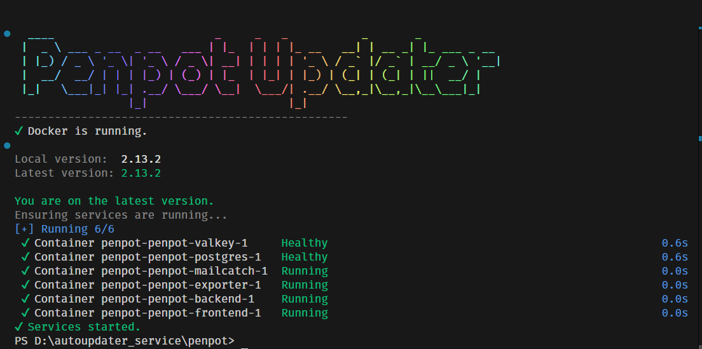

# Penpot Auto-Update Service

A tool to update penpot on a self hosted docker instance



## Features

- **🚀 Automatic Version Checks**: Checks GitHub releases on startup against your local version.
- **🖥️ Terminal UI**: Beautiful ASCII banner, progress spinners, and clear prompts.
- **🛡️ Safe Updates**:
  - Automatic backup of `docker-compose.yaml` before every update.
  - Uses native Docker progress bars for transparent downloads.
- **🧠 Smart Detection**: Reads version info from `version.txt`, `.env`, or `docker-compose.yaml` tags.

## Prerequisites

- **Docker Desktop** (Running)
- **Node.js** (Installed and in system PATH)

## Setup

1.  **Directory Structure**:
    Ensure your folder looks like this:

    ```
    autoupdater_service/
    └── penpot/
        ├── docker-compose.yaml  (Your Penpot configuration)
        ├── package.json         (Dependencies)
        ├── index.js             (Updater logic)
        └── start_penpot.bat     (Launcher)
    ```

2.  **Install Dependencies**:
    Open a terminal in the `penpot` directory and run:
    ```bash
    npm install
    ```

## Usage

### Start Penpot (with Auto-Update)

Simply check for updates and start the service by running the batch file:

**`start_penpot.bat`**

- If an **update is found**: You will be prompted to update. If you say "Yes", it backs up your config, pulls new images, and restarts Penpot.
- If **no update**: It simply ensures your Penpot containers are up and running.

### Configuration

You can adjust settings in `penpot/config.js` if you need to point to a different repository or file path.

## Troubleshooting

- **"Docker is not running"**: Make sure Docker Desktop is started.
- **"Unknown" version**: Ensure your `docker-compose.yaml` uses standard `image:` tags or defines `PENPOT_VERSION` in a `.env` file.
